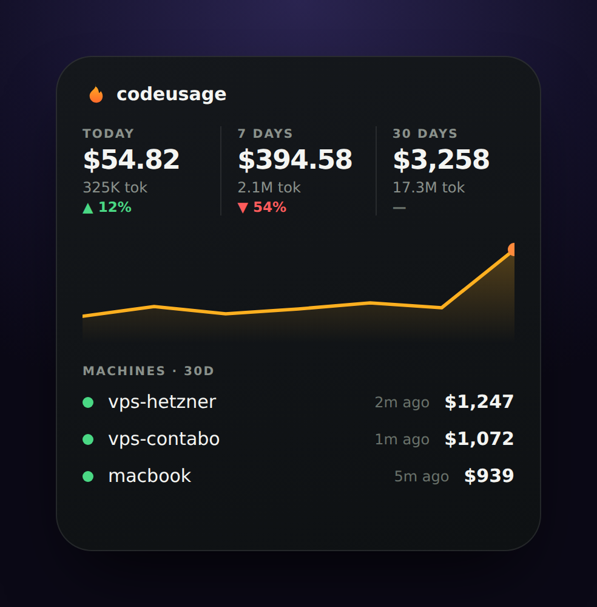

# codeusage 🔥

Track your **Claude Code** token & $ usage across all your machines — on one iOS widget. Self-hosted, tiny, no account.

## Features

- **All your machines in one place** — VPSes + Macs, each with a **last-seen** time (green = active, red = inactive).
- **today / 7d / 30d** — dollars, tokens, and trend vs the previous period.
- **iOS Large widget** (via Scriptable).
- **One-line agent install**, no admin. Self-hosted, MIT.

## Setup

See **[INSTALL.md](INSTALL.md)** — deploy the server, add machines with a one-liner, add the widget.

## How it works

Each machine runs [`ccusage`](https://github.com/ccusage/ccusage) and pushes its daily totals to a tiny Go + SQLite server (every 20 min); your widget reads one endpoint. Dollars are cache-weighted (API-equivalent); the token count shown is input + output.

## Coming soon

- 🏆 **Leaderboard** — see how your burn stacks up against others (opt-in).
- 🤖 **Every coding agent** — Codex, GitHub Copilot CLI, Gemini CLI, and more — not just Claude Code.
- ☁️ **Cloud version** — a fully hosted option, no server to run yourself.

## License

MIT — see [LICENSE](LICENSE).
